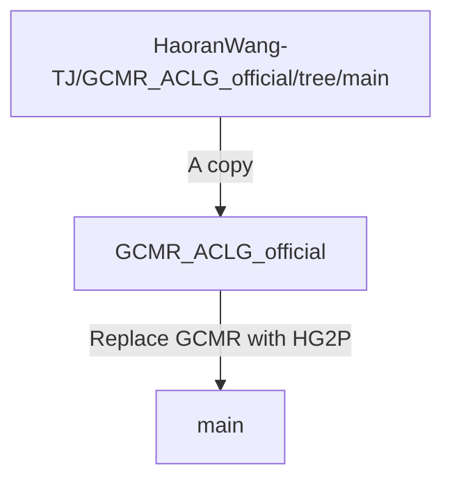

# HG2P: Hippocampus-inspired High-reward Graph and Model-Free Q-Gradient Penalty for Path Planning and Motion Control
This is a PyTorch implementation for our paper: [HG2P: Hippocampus-inspired high-reward graph and model-free Q-gradient penalty for path planning and motion control](https://www.sciencedirect.com/science/article/pii/S0893608025006616).
```bibtex
@article{wang2025hg2p,
  title={HG2P: Hippocampus-inspired high-reward graph and model-free Q-gradient penalty for path planning and motion control},
  author={Wang, Haoran and Sun, Yaoru and Tang, Zeshen and Shi, Haibo and Jiao, Chenyuan},
  journal={Neural Networks},
  volume = {191},
  pages={107781},
  year={2025},
  publisher={Elsevier},
  doi={https://doi.org/10.1016/j.neunet.2025.107781}
}
```

Our code is based on official implementation of [HIGL](https://github.com/junsu-kim97/HIGL) (NeurIPS 2021).

### Bug Fix
:top::up: [2025-8-7] This update corresponds to our final published version in [*Neural Networks*](https://www.sciencedirect.com/science/article/pii/S0893608025006616). In this update, we optimized the runtime efficiency of the high-reward sampling module; and refined the pipeline for estimating the expected return $\bar{A}^{(i)}$ of each initial-state–final-goal pair $ \langle s^{(i)}_{0}, g^{(i)} \rangle$.

:bug::pushpin: [2024-12-11] We have identified an implementation bug that significantly impacts the algorithm's performance and results: we are currently using a linear estimator ([LinearRegression](https://github.com/HaoranWang-TJ/HG2P_ACLG_official/blob/main/algo/utils.py#L560)) to estimate the expected return of the initial-state-final-goal pair $ \langle s_{0}, g \rangle$. However, the relationship between the initial-state-final-goal pair and the final episodic reward is inherently nonlinear. To address this, we are transitioning to a nonlinear estimator, which will be introduced in the next version.

## Branch Tree
We implemented our code based on our another repository [GCMR_ACLG_official](https://github.com/HaoranWang-TJ/GCMR_ACLG_official), which serves as a baseline and comparison.
This repository was implemented as follows:



## Installation
```
conda create -n aclg_hg2p python=3.7
conda activate aclg_hg2p
./install_all.sh
```

Also, to run the MuJoCo experiments, a license is required (see [here](https://www.roboti.us/license.html)).

## Install MuJoCo
### MuJoCo210
1. Download the MuJoCo version 2.1 binaries for
   [Linux](https://mujoco.org/download/mujoco210-linux-x86_64.tar.gz) or
   [OSX](https://mujoco.org/download/mujoco210-macos-x86_64.tar.gz).
2. Extract the downloaded `mujoco210` directory into `~/.mujoco/mujoco210`.
```
mkdir ~/.mujoco
tar -zxvf mujoco210-linux-x86_64.tar.gz -C ~/.mujoco/
```

If you want to specify a nonstandard location for the package,
use the env variable `MUJOCO_PY_MUJOCO_PATH`.
```
vim ~/.bashrc
export LD_LIBRARY_PATH=$LD_LIBRARY_PATH:~/.mujoco/mujoco210/bin
export LD_LIBRARY_PATH=$LD_LIBRARY_PATH:/usr/lib/nvidia
source ~/.bashrc
```

### MuJoCo200
1. Download the MuJoCo version 2.0 binaries for
   [Linux](https://www.roboti.us/download/mujoco200_linux.zip) or
   [OSX](https://www.roboti.us/download/mujoco200_macos.zip).
2. Extract the downloaded `mujoco200` directory into `~/.mujoco/mujoco200`.

```
vim ~/.bashrc
export LD_LIBRARY_PATH=$LD_LIBRARY_PATH:~/.mujoco/mujoco200/bin
export LD_LIBRARY_PATH=$LD_LIBRARY_PATH:/usr/lib/nvidia
source ~/.bashrc
```

***Key license***

Also, to run the MuJoCo experiments using MuJoCo200, a license is required (see [here](https://www.roboti.us/license.html)).
```bash
e.g., cp mjkey.txt ~/.mujoco/mjkey.txt
```

## Usage
### Training & Evaluation
- Ant Maze (U-shape)
```
./scripts/aclg_hg2p_ant_maze_u.sh ${reward_shaping} ${timesteps} ${gpu} ${seed}
./scripts/aclg_hg2p_ant_maze_u.sh sparse 7e5 0 2
./scripts/aclg_hg2p_ant_maze_u.sh dense 7e5 0 2
```

- Ant Push
```
./scripts/aclg_hg2p_ant_push.sh ${reward_shaping} ${timesteps} ${gpu} ${seed}
./scripts/aclg_hg2p_ant_push.sh sparse 7e5 0 2
./scripts/aclg_hg2p_ant_push.sh dense 7e5 0 2
```

- Point Maze
```
./scripts/aclg_hg2p_point_maze.sh ${reward_shaping} ${timesteps} ${gpu} ${seed}
./scripts/aclg_hg2p_point_maze.sh sparse 5e5 0 2
./scripts/aclg_hg2p_point_maze.sh dense 5e5 0 2
```

- Ant Maze (W-shape)
```
./scripts/aclg_hg2p_ant_maze_w.sh ${reward_shaping} ${timesteps} ${gpu} ${seed}
./scripts/aclg_hg2p_ant_maze_w.sh sparse 6e5 0 2
./scripts/aclg_hg2p_ant_maze_w.sh dense 6e5 0 2
```

- Reacher & Pusher
```
./scripts/aclg_hg2p_fetch.sh ${env} ${timesteps} ${gpu} ${seed}
./scripts/aclg_hg2p_fetch.sh Reacher3D-v0 5e5 0 2
./scripts/aclg_hg2p_fetch.sh Pusher-v0 5e5 0 2
```

- FetchPickAndPlace & FetchPush
```
./scripts/aclg_hg2p_openai_fetch.sh ${env} ${timesteps} ${gpu} ${seed}
./scripts/aclg_hg2p_openai_fetch.sh FetchPickAndPlace-v1 10e5 0 2
./scripts/aclg_hg2p_openai_fetch.sh FetchPush-v1 5e5 0 2
```

- Stochastic Ant Maze (U-shape)
```
./scripts/aclg_hg2p_ant_maze_u_stoch.sh ${reward_shaping} ${timesteps} ${gpu} ${seed}
./scripts/aclg_hg2p_ant_maze_u_stoch.sh sparse 7e5 0 2
./scripts/aclg_hg2p_ant_maze_u_stoch.sh dense 7e5 0 2
```

- Large Ant Maze (U-shape)
```
./scripts/aclg_hg2p_ant_maze_u_large.sh ${reward_shaping} ${timesteps} ${gpu} ${seed}
./scripts/aclg_hg2p_ant_maze_u_large.sh sparse 12e5 0 2
./scripts/aclg_hg2p_ant_maze_u_large.sh dense 12e5 0 2
```

- Ant Maze Bottleneck
```
./scripts/aclg_hg2p_ant_maze_bottleneck.sh ${reward_shaping} ${timesteps} ${gpu} ${seed}
./scripts/aclg_hg2p_ant_maze_bottleneck.sh sparse 7e5 0 2
./scripts/aclg_hg2p_ant_maze_bottleneck.sh dense 7e5 0 2
```